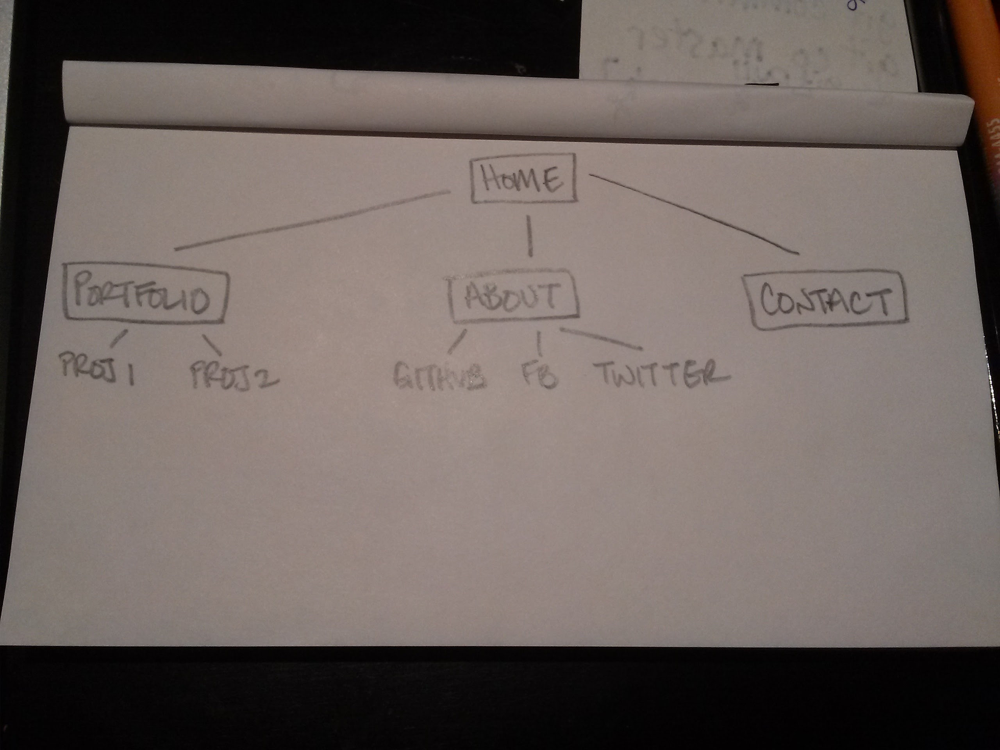

What are the 6 Phases of Web Design?

  Information gathering, Planning, Design, Development, Testing and Delivery, and Maintenance.

What is your site's primary goal or purpose? What kind of content will your site feature?

  My site's primary goal is to showcase my accomplishments as a developer and make my skills appear desireable to potential employers. It will feature examples of projects I have worked on in the past, and information about myself.

What is your target audience's interests and how do you see your site addressing them?

  My target audience is primarily interested in hiring a web developer, and my site is going to address them professionally a mind in business.

What is the primary "action" the user should take when coming to your site? Do you want them to search for information, contact you, or see your portfolio? It's ok to have several actions at once, or different actions for different kinds of visitors.

  First, they will want to check out my portfolio. Then, they will find my contact information and call me in the hopes that somebody else hasn't swept me up already.

What are the main things someone should know about design and user experience?

  People should know that design is about more than how a website looks. It is also about organizing information and making a website useable.
  User experience is about how users feel about a website. Whether it is frustrating and difficult, or simple and effortless.

What is user experience design and why is it valuable?

  User experience design focuses on the way users feel when they visit a website. If users aren't able to do what they came to do, they are unlikely to return. The goal is to make things easy and maybe even fun for the users, to encourage website traffic.

Which parts of the challenge did you find tedious?
  There was a lot of reading, and not very much hands-on coding. Fortunately, it was an interesting and enjoyable read.