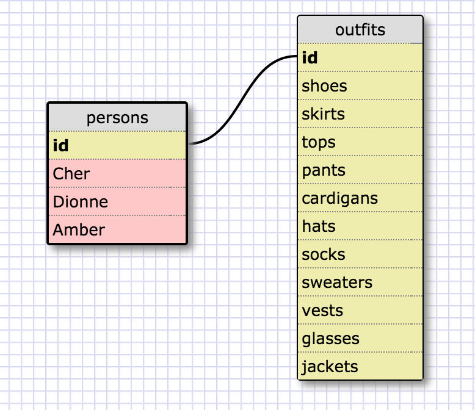

##What are databases for?
Databases are for storing large amounts of information in an organized library. They make accessing specific pieces of information easier than arrays or hashes for large amount of information.

##What is a one-to-many relationship?
One-to-many means that a thing is a part of larger category of things. A whippet is a kind of dog, for instance. Pumpkins are a kind of squash. Earl Grey is a kind of tea. And so on.

##What is a primary key? What is a foreign key? How can you determine which is which?
A primary key is a value associated with each unique record. If you have a table of information on Keanu Reeves' movies, the primary key might be the movie title since that will be unique to each movie where other values might not be. A foreign key ties tables together. It gives two tables a common value to match up information on a record. A separate table of all the characters Keanu has played might have a movie_id key that indicates which movie that character appeared in. By matching up movie_id and the movie titles from the first table, you have all the information of all the movies and how they relate to all the information of all the characters at your fingertips. We might as well start calling you Neo.

##How can you select information out of a SQL database? What are some general guidelines for that?
By using the SELECT command, listing the fields you want returned, and then using the command FROM to specify which database holds the fields your asking for. There are many ways to add specifications to your queries, including greater than and less than operands. You can find things that match a certain letter or string of letters by using the command LIKE. There's also BETWEEN, AND and OR, that can all be used to tailer your search results.